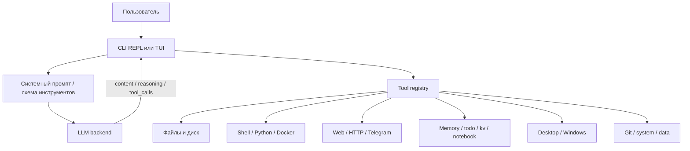
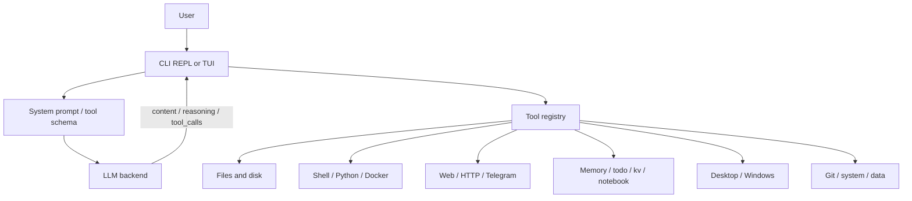

<p align="center">
  <strong>Лёгкий CLI + TUI агент для локальных и облачных LLM с реальным tool calling</strong><br>
  Один Python-файл • Минимум зависимостей • Native + prompt-based режимы • Windows / Linux / Termux • Красивый TUI на Textual
</p>

<p align="center">
  
  
  
  
  
  
  
</p>
 
<p align="center">
  <a href="#-русская-версия">Русский</a> · <a href="#-english-version">English</a>
</p>

> [!IMPORTANT]
> Проект находится в активной разработке. Часть возможностей уже рабочая и полезная, но не весь стек обещает полную завершённость, одинаковую стабильность на всех платформах или одинаковое поведение во всех моделях и backends.

> [!WARNING]
> Это инструмент с доступом к реальным действиям. Он снижает риск, но не делает любую модель безопасной по умолчанию. Для критичных задач всегда нужен контроль оператора.

---

Universal LLM Agent возник просто потому, что мне был нужен именно такой агент. В нём хватает косяков, странностей и экспериментальных решений, но это мой личный проект. Если он окажется полезен не только мне, значит всё это было не зря.


https://github.com/user-attachments/assets/dd61a5bf-4409-4eeb-8210-2ba6bccc39cb


---

# 🇷🇺 Русская версия

## Что это такое

Universal LLM Agent — это CLI/TUI-агент, который подключает языковую модель к инструментам операционной системы, файлам, сети, памяти, desktop-автоматизации, Docker-песочнице, мессенджерам (Telegram) и планировщикам задач.

В версии **2.0** (файл `ai_agent.py`) ядро прежнего консольного агента (`local_agent.py`) объединено с графическим TUI на библиотеке [Textual](https://textual.textualize.io/). Это один Python-файл, который можно запустить в двух интерфейсах:
- **TUI** — полноэкранный интерфейс с чатом, сайдбаром, анимациями звёздного неба и плавным появлением сообщений;
- **Console** — классический REPL, работающий только на стандартной библиотеке Python 3.11+.

Модель не просто отвечает текстом — она вызывает функции через единый слой инструментов (более 100 штук).

Главная особенность проекта: он умеет работать в двух мирах одновременно:
- с моделями, у которых уже есть нативный `tools` API (OpenAI-совместимый);
- с моделями, у которых инструментов нет вовсе, но их можно аккуратно "научить" через prompt-based режим (Hermes-style `<tool_call>`).

> [!NOTE]
> README написан честно: где возможности уверенные — сказано прямо; где поведение экспериментальное — отмечено явно.

---

## Статус проекта

> [!WARNING]
> Проект находится в активной доработке.
>
> Это значит:
>
> - часть функций уже работает стабильно;
> - часть функций остаётся экспериментальной / тестовой;
> - внутренние детали, имена параметров и поведение отдельных инструментов могут меняться;
> - обратная совместимость не гарантируется на 100%;
> - для важных сценариев лучше сначала прогнать проверку в контролируемой среде.

---

## Почему этот проект выглядит именно так

Ядро проекта намеренно остаётся простым:

- один Python-файл (`ai_agent.py`);
- только стандартная библиотека в самом ядре (консольный режим не требует pip-пакетов);
- прозрачный реестр инструментов (`ToolRegistry`);
- понятный REPL + красивый TUI;
- локальные конфиги без лишнего сервиса;
- поддержка локальных и облачных backend’ов.

Это не попытка собрать "магический AGI-оркестр". Это практичный агентный runtime: его можно открыть, прочитать, изменить и запустить без лишней инфраструктуры.

---

## Что он умеет по сути

Агент умеет:

- стримить ответ модели по мере генерации (текст + reasoning/thinking);
- отдельно показывать рассуждения модели;
- собирать tool calls из стрима и из обычного текста;
- переключаться между native и prompt tool calling;
- выполнять несколько независимых вызовов параллельно (`<tools_call>` + `ThreadPoolExecutor`);
- хранить заметки, todo, KV-данные и блочный блокнот между сессиями;
- работать с файлами, shell, Python, HTTP, Git, system tools и Windows desktop;
- запускать опасные эксперименты в изолированном Docker-контейнере (`sandbox_run`);
- принимать сообщения из Telegram и отвечать в Telegram / Discord;
- запрашивать "второе мнение" у той же LLM через `ask_helper` (роли: critic, planner, interpreter, reviewer, creative, roleplayer);
- выдавать понятный цветной CLI-вывод или красивый TUI с анимациями.

---

## Режимы запуска

```bash
python ai_agent.py            # TUI (Textual) — режим по умолчанию
python ai_agent.py --console  # Консольный REPL-режим
python ai_agent.py --console --backend ollama   # Консоль + пресет бэкенда
python ai_agent.py --console --model qwen2.5:7b --base-url http://localhost:11434/v1
```

| Режим | Зависимости | Назначение |
|---|---|---|
| TUI | `textual`, `rich`, `pyperclip` (опц.), `psutil`, `win10toast` (опц.), `Pillow` | Полноэкранный интерфейс с чатом, сайдбаром, автодополнением команд |
| Console | Только stdlib Python 3.11+ | Классический REPL, минимальные требования к окружению |

---

## Как это работает



### Режимы tool calling

- `native` — агент передаёт инструменты через OpenAI-совместимый `tools` API;
- `prompt` — агент подсовывает модели Hermes-style инструкции с `<tool_call>`;
- `auto` — агент пробует native, а если backend не поддерживает инструменты, переходит на prompt-fallback.

> [!TIP]
> Для Ollama, LM Studio и vLLM удобнее native-режим. Для KoboldCpp / llama.cpp — prompt-режим.

### Что именно парсится

Агент умеет:
- стримить `content` и `reasoning_content`;
- собирать `tool_calls` по кускам из SSE/стрима;
- разбирать `<think>...</think>` и жёстко скрывать их от пользователя;
- разбирать `<tool_call>...</tool_call>`;
- разбирать `<tools_call>...</tools_call>` для параллельных вызовов;
- извлекать инструмент даже из "сырого" JSON, если модель написала его без тега.

---

## Поддерживаемые backend’ы

| Backend | Native tools | Base URL | Комментарий |
|---|---:|---|---|
| Ollama | Да | `http://localhost:11434/v1` | `ollama serve` + `ollama pull <model>` |
| LM Studio | Да | `http://localhost:1234/v1` | Включить Local Server на 1234 |
| vLLM | Да | `http://localhost:8000/v1` | `--tool-call-parser hermes` |
| OpenAI | Да | `https://api.openai.com/v1` | Нужен `OPENAI_API_KEY` |
| OpenRouter | Да | custom | Любой OpenAI-compatible endpoint |
| Groq | Да | `https://api.groq.com/openai/v1` | Нужен `GROQ_API_KEY` |
| Mistral | Да | `https://api.mistral.ai/v1` | Нужен `MISTRAL_API_KEY` |
| KoboldCpp | Нет | `http://localhost:5001/v1` | Prompt fallback |
| llama.cpp | Нет | `http://localhost:8080/v1` | Prompt fallback |
| Anthropic | Да* | через proxy | Требуется OpenAI-compatible прокси |

---

## Установка и запуск

### Быстрый вариант

Установка

```bash
pip install universal-llm-agent
```
Запуск

```bash
ai-agent           # TUI (по умолчанию)
ai-agent --console # Консольный режим
```
`Последующий запуск может быть в любом месте в cmd`

### Windows

Запускать нужно через:

```bat
Start.bat
```

Лаунчер делает следующее:
- проверяет, установлен ли Python;
- при необходимости скачивает Python 3.11.9 и ставит с PrependPath=1;
- ставит `textual rich pyperclip psutil win10toast Pillow`;
- автодетектит бэкенд через `netstat`;
- открывает меню запуска агента (TUI / Console / Exit).

### Linux / Termux

<details open>
<summary><strong>🐧 Готового лаунчера нет — агент запускается вручную из терминала</strong></summary>

#### 1. Убедитесь, что установлен Python 3.11+

```bash
python --version
```

2. Установите системные зависимости
Они нужны для Pillow и корректной работы Textual.

Debian / Ubuntu

```bash
sudo apt update
sudo apt install python-pip 
```

Termux

```bash
pkg install python python-pip 
```

3. Установите Python-зависимости для TUI

```bash
pip install textual rich pyperclip psutil Pillow
```

4. Запустите агента

```bash
python ai_agent.py            # TUI (по умолчанию)
python ai_agent.py --console  # Консольный режим
```
</details>

> [!NOTE]
> Для чисто консольного режима (`--console`) зависимости не нужны — только stdlib.

---

> [!NOTE]
> **Для пользователей из России и других стран с ограничениями доступа:**
> Если вы используете облачные API который заблокирован в России (OpenAI, OpenRouter, Groq и др.), может потребоваться VPN или прокси, иначе код будет выдавать ошибку "Forbidden".
> Также вы всегда можете использовать локальные бэкенды (Ollama, LM Studio) — они работают без интернета.

---

## Конфигурация и локальные файлы

При первом запуске агент сохраняет профиль и данные в домашней директории пользователя.

| Файл | Назначение |
|---|---|
| `~/.local_agent_user.json` | API key, base URL, model, имя пользователя/агента, Telegram/Discord |
| `~/.local_agent_prompt.json` | Сохранённый системный промпт (с версией `AGENT_VERSION`) |
| `~/.local_agent_memory.json` | Локальная память (`memory`) |
| `~/.local_agent_kv.sqlite` | KV-хранилище на SQLite |
| `~/.local_agent_notebook.md` | Блочный блокнот долгосрочной памяти |
| `~/.mimo_tui_session.json` | История TUI-сессии |

### Важная деталь про пути

Пути разрешаются относительно `AGENT_WORKSPACE`, если путь относительный. Абсолютные пути тоже возможны. Это удобно, но это не "жёсткая песочница". Агент помогает работать с файлами, но не закрывает их бронёй от любой ошибки модели.

---

## CLI-команды (консольный режим)

| Команда | Что делает |
|---|---|
| `/tools` | Показать список инструментов и их параметры |
| `/clear` | Очистить историю диалога |
| `/history [N]` | Показать последние N сообщений |
| `/save <file>` | Сохранить сессию |
| `/load <file>` | Загрузить сессию |
| `/system [prompt]` | Просмотр или редактирование системного промпта |
| `/workspace [dir]` | Сменить рабочую директорию агента |
| `/mode <auto/native/prompt>` | Принудительно переключить режим tool calling |
| `/compact [on/off]` | Компактный промпт (меньше токенов) |
| `/profile` | Изменить API-профиль (api_key, base_url, model, tg_token, tg_chat_id) |
| `/auto` | Вкл/выкл авто-режим (таймер самостоятельности агента) |
| `/paste` | Вставить clipboard как user-сообщение (Windows) |
| `/tokens` | Статистика токенов за сессию |
| `/stats` | Статистика вызовов инструментов |
| `/verbose [on/off]` | Подробный вывод отладки |
| `/info` | Системная информация |
| `/help` | Справка |
| `/exit` | Выход |

### Горячие клавиши TUI

| Клавиша | Действие |
|---|---|
| `Enter` | Отправить сообщение |
| `Shift+Enter` | Новая строка в поле ввода |
| `Tab` | Сменить режим (Build / Chat / Auto / User) |
| `↑ / ↓` | История ввода или навигация по меню |
| `Ctrl+N` | Меню настроек |
| `Ctrl+L` | Очистить чат |
| `Ctrl+C` | Остановить генерацию или выйти |

---

## Безопасность: что защищено, а что нет

> [!WARNING]
> Этот проект не является полноценной песочницей. Он снижает риск, но не отменяет его.

В коде есть несколько уровней защиты:

- безопасный калькулятор через AST вместо `eval()` (с лимитом глубины);
- блок-лист опасных shell-команд (`rm -rf /`, `mkfs`, `dd if=/dev/...` и т.д.);
- таймауты на Python, shell и HTTP;
- проверка и нормализация JSON-аргументов;
- ограничение размера JSON для запросов и KV-хранилища (5 МБ);
- best-effort песочница для Python на Unix (`RLIMIT_AS`, `RLIMIT_CPU`, запрет fork);
- защита от ReDoS в `grep` (поток с таймаутом);
- **Docker-песочница** (`sandbox_run`) — изолированный контейнер для опасных экспериментов.

### Что означает "Тестово"

Слово "Тестово" здесь не декоративное. Оно означает вот что:

- защита **есть**, но она не гарантирует абсолютную безопасность;
- sandbox в Python — это только частичная изоляция, а не полноценный jail;
- shell-команды всё равно остаются опасным инструментом;
- модель может ошибиться, галлюцинировать, перепутать файл, путь или команду;
- плохой промпт может привести к неправильным действиям даже при наличии guardrails.

Именно поэтому проект стоит воспринимать как мощный инструмент для аккуратной автоматизации, а не как неуязвимую систему.

### Что стоит помнить оператору

- не давать расплывчатые команды в критичных задачах;
- не отключать проверки без понимания последствий;
- не запускать непроверенные действия на важной машине;
- проверять, что именно модель собирается сделать, если задача затрагивает файлы, shell или удалённые запросы.

> [!CAUTION]
> Если агенту разрешить выполнять слишком общие или слишком опасные действия без контроля, ответственность за последствия остаётся на операторе, а не на README.

---

## Что проект не обещает

> [!CAUTION]
> Проект не обещает:
>
> - полной безошибочности;
> - стопроцентной безопасности;
> - одинакового поведения на всех моделях;
> - мгновенной совместимости со всеми backends;
> - отсутствия поломок при экспериментальных настройках;
> - гарантированной обратной совместимости между версиями.

---

## Каталог инструментов (110+)

У проекта **более 100 инструментов**. Ниже они сгруппированы так, чтобы было проще понять, что за что отвечает. Точные схемы (параметры, enum, default) — в `/tools` внутри агента.

<details>
<summary><strong>📁 Файлы и диск</strong> (21)</summary>

- `read_file` — Чтение текстового файла с offset/limit.
- `write_file` — Запись файла (создание родительских папок).
- `edit_file` — Точечная замена текста.
- `list_files` — Список файлов/директорий (glob, hidden).
- `search_files` — Рекурсивный поиск по glob.
- `grep` — Поиск по содержимому (regex, защита от ReDoS).
- `file_info` — Инфо о файле/директории.
- `find_large_files` — Большие файлы (фильтр node_modules/.git).
- `disk_usage` — Использование диска по папкам.
- `move` — Перемещение файла/директории.
- `copy_file` — Копирование файла.
- `create_dir` — Создание директории.
- `path_info` — Нормализация и разбор пути.
- `binary_read` — Hex/Base64 дамп бинарного файла.
- `binary_write` — Запись бинарных данных.
- `binary_patch` — Патч бинарника (find_hex → replace_hex).
- `checksum_file` — Хеш файла (md5/sha1/sha256/sha512).
- `tail_file` — Хвост файла (follow для логов).
- `head_file` — Первые строки файла.
- `archive` — Упаковка/распаковка zip/tar/gz/bz2/xz.
</details>

<details>
<summary><strong>💻 Код и вычисления</strong> (25)</summary>

- `run_python` — Python в подпроцессе (+ sandbox на Unix).
- `run_shell` — Shell-команда (блок-лист опасного).
- `powershell` — PowerShell (только Windows).
- `calculator` — Безопасный AST-калькулятор.
- `convert_units` — Конвертация длины/массы/байт/времени/температуры.
- `token_estimate` — Оценка токенов (эвристика).
- `diff_text` — Diff двух текстов.
- `regex_test` — Тест regex с флагами.
- `format_json` — Форматирование/валидация JSON.
- `json_query` — Извлечение по точечному пути.
- `encode_text` — Перекодировка (utf8/cp1251/hex/base64/url).
- `decode_text` — Обратное декодирование.
- `jsonl_read` — Чтение JSON Lines.
- `jsonl_write` — Запись JSON Lines.
- `base64_encode` / `base64_decode` — Base64.
- `hash_string` — Хеш строки.
- `uuid_gen` — Генерация UUID (v1/v4/v7).
- `generate_password` — Криптостойкий пароль (secrets).
- `csv_read` / `csv_write` — CSV как таблица.
- `xml_parse` — Парсинг XML → JSON.
- `rss_read` — Чтение RSS/Atom.
- `sqlite_query` — SQL к произвольному .db.
- `python_process_manage` — Фоновые скрипты (run/kill/list).
</details>

<details>
<summary><strong>🌐 Веб и сеть</strong> (8)</summary>

- `web_search` — DuckDuckGo HTML (без API-ключа).
- `web_fetch` — Загрузка URL как текст.
- `http_request` — Произвольный HTTP.
- `http_retry` — HTTP + exponential backoff.
- `url_encode` / `url_decode` — URL-кодирование.
- `port_check` — Проверка TCP-порта.
- `wifi_list` — WiFi-профили и пароли (Windows).
</details>

<details>
<summary><strong>🪟 Windows Desktop</strong> (18)</summary>

- `list_windows` — Список окон.
- `get_window_text` — Текст окна + дочерние элементы.
- `focus_window` — На передний план.
- `close_window` — Закрыть (force = kill).
- `open_program` — Запуск программы/файла/URL.
- `window_send_keys` — Отправка клавиш ({ENTER}, {CTRL+a}).
- `click_window` — Клик по элементу/координатам.
- `screenshot_window` — Скриншот окна (PrintWindow API).
- `clipboard` — Буфер обмена (read/write).
- `process_list` — Список процессов.
- `kill_process` — Завершение по PID/имени.
- `registry_read` — Чтение реестра.
- `registry_manage` — Запись/удаление (требует confirm).
- `service_list` / `service_manage` — Службы Windows.
- `wmi_query` — WMI-запросы.
- `system_stats` — CPU/RAM/батарея/температура.
- `notify` — Системное уведомление.
</details>

<details>
<summary><strong>📝 Память и организация</strong> (14)</summary>

- `memory` — Долговременная память (save/load/list/delete).
- `kv_store` — KV на SQLite (set/get/list/delete/search).
- `todo` — Список задач.
- `notebook_list` / `notebook_read` / `notebook_write` / `notebook_delete` — Блочный блокнот.
- `system_info` — Инфо о системе.
- `get_datetime` — Текущее время.
- `timer` — Таймер (блокирующий).
- `session_summary` — Сжатие истории через резюме.
- `env_get` / `env_list` — Переменные окружения.
- `secret_manage` — Хранение паролей (keyring).
- `ask_helper` — Второе мнение от той же LLM.
</details>

<details>
<summary><strong>🔌 Интеграции и автоматизация</strong> (20)</summary>

- `telegram_manage` — Отправка в Telegram (бот).
- `discord_manage` — Webhook в Discord.
- `email_manage` — Отправка почты (SMTP).
- `websocket_manage` — WebSocket client.
- `browser_manage` — Открытие ссылок.
- `docker_manage` — Docker run/stop/exec.
- `sandbox_run` — Изолированная Docker-песочница (bash/python).
- `pip_manage` — Установка pip-пакетов.
- `venv_manage` — Виртуальные окружения.
- `task_manage` — Планировщик Windows.
- `startup_manage` — Автозапуск (реестр/crontab).
- `orchestration_manage` — Ansible / Kubernetes.
- `watch_file` — Наблюдение за файлом.
- `watch_process` — Наблюдение за процессом.
- `scheduled_message` — Отложенное напоминание.
- `self_update` — Самообновление скрипта.
- `media_manage` — Звук/скриншот.
- `power_manage` — Сон/гибернация.
- `gui_manage` — GUI-управление.
</details>

<details>
<summary><strong>📊 Данные и прочее</strong> (5)</summary>

- `search_all` — Поиск по именам и содержимому.
- `diff_files` — См. Файлы.
</details>

---

## Репозиторные скрипты

### `Start.bat`

Windows-лаунчер: Python + зависимости + автодетект бэкенда + меню.

### `ai_agent.py`

Единый файл: ядро + TUI. Запуск `python ai_agent.py` или с `--console`.

---

## Для кого этот проект

Подходит, если нужен агент, который:
- работает локально;
- не прячется за тяжёлым фреймворком;
- умеет реальные действия, а не только диалог;
- имеет TUI и консоль;
- можно быстро прочитать и дописать под себя.

Не подходит, если нужен "готовый магический комбайн" без контроля.

---

### 📜 Лицензия

Этот проект распространяется под лицензией MIT. Подробнее см. в файле [LICENSE](LICENSE).
---

## 💡 О вдохновении

Этот проект создавался как **самостоятельная реализация** идеи, которая мне очень понравилась в интерфейсе **Mimo Code от Xiaomi**. 
Мне понравилась их визуальная философия связаная с космосом, но я **не копировал их код** и не выдавал их работу за свою. 
Я написал всё с нуля, своими руками, с собственными ошибками, костылями и решениями. 
Это мой личный, кривой, но родной проект. Спасибо команде Mimo за идею — она вдохновила меня сделать свой вариант.

---

## Частые вопросы

<details>
<summary><strong>Почему два интерфейса (TUI и Console)?</strong></summary>

TUI удобен для повседневной работы с анимациями и чатом, а консольный режим — для серверов и минимальных окружений (только stdlib).
</details>

<details>
<summary><strong>Зачем Docker-песочница?</strong></summary>

Чтобы дать агенту ломать всё в изолированном контейнере, не трогая хост. Особенно полезно в авто-режиме (фоновые эксперименты).
</details>

<details>
<summary><strong>Почему так много защитных оговорок?</strong></summary>

Потому что агент исполняет реальные действия. Красивый README не должен создавать иллюзию абсолютной безопасности.
</details>

---

<details>
<summary><strong>Почему проект всё ещё развивается?</strong></summary>

Universal LLM Agent не создавался как коммерческий продукт или попытка собрать очередной "идеальный AI-фреймворк".
Это личный проект, который растёт вместе с задачами, которые я решаю сам. Многие функции появились потому, что однажды мне не хватило их в другом агенте, а потом оказалось, что они полезны и другим.
Если какая-то часть проекта кажется необычной, скорее всего, за ней стоит вполне конкретная причина. И если у вас есть идея, как сделать её лучше, я буду рад её обсудить.
</details>

---

## Благодарность за помощь

<div align="center">
  <a href="https://github.com/geme325" title="QA-тестер">
    
    <br />
    <sub><b>geme325</b></sub>
  </a>
</div>

## Помощь

Если вы нашли баги, ошибки или столкнулись с проблемами, пишите на byteghosthelper@gmail.com (желательно с `/save bug`).

---


# 🇺🇸 English Version


## Universal LLM Agent

---
The Universal LLM Agent came into existence simply because I needed exactly that kind of agent. It has its fair share of flaws, quirks, and experimental choices, but it is my personal project. If it turns out to be useful to others besides me, then it was all worth it.

> [!NOTE]
> The demo below is in Russian (the agent currently ships with a Russian-only system prompt/context). English localization is planned — for now the video still shows the actual TUI, tool calling, and workflow in action.

https://github.com/user-attachments/assets/dd61a5bf-4409-4eeb-8210-2ba6bccc39cb

---

<p align="center">
  <strong>Lightweight CLI + TUI agent for local and cloud LLMs with real tool calling</strong><br>
  Single Python file • Minimal dependencies • Native + prompt-based modes • Windows / Linux / Termux • Beautiful Textual TUI
</p>

<p align="center">
  
  
  
  
  
  
  
</p>

> [!IMPORTANT]
> The project is under active development. Some features are already working and useful, but the whole stack does not promise full completeness, identical stability across all platforms, or identical behavior across all models and backends.

> [!WARNING]
> This is a tool with access to real actions. It reduces risk but does not make any model safe by default. For critical tasks, operator supervision is always required.

---

## What it is

Universal LLM Agent is a lightweight CLI/TUI agent that connects an LLM to real tools: files, shell, Python, Docker sandbox, HTTP, Telegram, Windows desktop automation, and more.

In version **2.0** (`ai_agent.py`) the core of the former console agent (`local_agent.py`) is merged with a Textual-based TUI. It is a single Python file that can run in two interfaces:
- **TUI** — full-screen chat with sidebar, starfield animations, smooth message arrival;
- **Console** — classic REPL working on stdlib Python 3.11+ only.

The model does not just generate text. — it calls functions via a unified tool layer (110+ tools).

Key feature: it works in two worlds at once:
- models with native `tools` API (OpenAI-compatible);
- models without tools, taught via prompt-based Hermes-style `<tool_call>` fallback.

> [!NOTE]
> This README is intentionally honest: stable pieces are described as stable, experimental pieces are called out explicitly.

---

## Project status

> [!WARNING]
> The project is under active development.
>
> That means:
>
> - some features are already reliable and usable;
> - some parts remain experimental / test-oriented;
> - internal details, parameter names, and tool behavior may change;
> - backward compatibility is not guaranteed 100%;
> - for important workflows, test it first in a controlled environment.

---

## Why this project looks this way

The core stays deliberately simple:

- one Python file (`ai_agent.py`);
- standard library only in the core (console mode needs no pip packages);
- a transparent tool registry (`ToolRegistry`);
- a straightforward REPL + a beautiful TUI;
- local config files instead of a heavy service stack;
- support for both local and cloud backends.

This is not an attempt to build a magical AGI orchestra. It is a practical agent runtime you can open, read, modify, and run without extra infrastructure.

---

## What it does in practice

The agent can:

- stream model output as it is generated (text + reasoning/thinking);
- show reasoning / thinking separately;
- collect tool calls from streamed chunks and plain text;
- switch between native and prompt tool calling;
- execute multiple independent tool calls in parallel (`<tools_call>` + `ThreadPoolExecutor`);
- store notes, todo items, key-value data and a block notebook between sessions;
- work with files, shell, Python, HTTP, Git, system tools, and Windows desktop;
- run dangerous experiments in an isolated Docker container (`sandbox_run`);
- receive messages from Telegram and reply via Telegram / Discord;
- request a "second opinion" from the same LLM via `ask_helper` (roles: critic, planner, interpreter, reviewer, creative, roleplayer);
- produce readable colored CLI output or a pretty animated TUI.

---

## Launch modes

```bash
python ai_agent.py            # TUI (Textual) — default
python ai_agent.py --console  # Console REPL mode
python ai_agent.py --console --backend ollama   # Console + backend preset
python ai_agent.py --console --model qwen2.5:7b --base-url http://localhost:11434/v1
```

| Mode | Dependencies | Purpose |
|---|---|---|
| TUI | `textual`, `rich`, `pyperclip` (opt.), `psutil`, `win10toast` (opt.), `Pillow` | Full-screen chat, sidebar, command autocomplete |
| Console | stdlib Python 3.11+ only | Minimal REPL, minimal environment |

---

## How it works



### Operating modes

- `native` — the agent sends tools through the standard OpenAI-compatible `tools` API;
- `prompt` — the agent injects Hermes-style `<tool_call>` instructions into the system prompt;
- `auto` — the agent tries native first and falls back when the backend does not support tools.

> [!TIP]
> For Ollama, LM Studio, and vLLM, native mode is usually the cleanest fit. For KoboldCpp and llama.cpp, prompt mode is often the practical choice.

### What gets parsed

From the code, the agent can:
- stream `content` and `reasoning_content`;
- accumulate `tool_calls` incrementally from the stream;
- parse `<think>...</think>` and hard-hide them from the user output;
- parse `<tool_call>...</tool_call>`;
- parse `<tools_call>...</tools_call>` for parallel calls;
- recover tool calls from raw JSON when a model emits JSON without the expected wrapper.

---

## Supported backends

| Backend | Native tools | Default base URL | Notes |
|---|---:|---|---|
| Ollama | Yes | `http://localhost:11434/v1` | `ollama serve` + `ollama pull <model>` |
| LM Studio | Yes | `http://localhost:1234/v1` | Enable the local server on port 1234 |
| vLLM | Yes | `http://localhost:8000/v1` | `--tool-call-parser hermes` |
| OpenAI | Yes | `https://api.openai.com/v1` | Needs `OPENAI_API_KEY` |
| OpenRouter | Yes | custom | Any OpenAI-compatible endpoint |
| Groq | Yes | `https://api.groq.com/openai/v1` | Needs `GROQ_API_KEY` |
| Mistral | Yes | `https://api.mistral.ai/v1` | Needs `MISTRAL_API_KEY` |
| KoboldCpp | No | `http://localhost:5001/v1` | Prompt fallback |
| llama.cpp | No | `http://localhost:8080/v1` | Prompt fallback |
| Anthropic | Yes* | via proxy | Requires an OpenAI-compatible proxy |

---

## Installation and launch

### Quick Start

Installation

```bash
pip install universal-llm-agent
```

Launch

```bash
ai-agent           # TUI (default)
ai-agent --console # Console mode
```
`Subsequent launches can be performed from any location in cmd.`

### Windows

Launch with:

```bat
Start.bat
```

The launcher:
- checks Python (downloads 3.11.9 with PrependPath=1 if missing);
- installs `textual rich pyperclip psutil win10toast Pillow`;
- auto-detects backend via `netstat`;
- opens the agent launch menu (TUI / Console / Exit).


### Linux / Termux

<details open>
<summary><strong>🐧 No pre-built launcher — the agent is started manually from the terminal</strong></summary>

#### 1. Ensure Python 3.11+ is installed

```bash
python --version
```

2. Install system dependencies
These are required for Pillow and for Textual to function correctly.

Debian / Ubuntu

```bash
sudo apt update
sudo apt install python-pip 
```

Termux

```bash
pkg install python python-pip 
```

3. Install Python dependencies for the TUI
```bash
pip install textual rich pyperclip psutil Pillow
```

4. Start the agent
```bash
python ai_agent.py            # TUI (default)
python ai_agent.py --console  # Console mode
```
</details>

> [!NOTE]
> For pure console mode (`--console`) no dependencies are needed — only stdlib.

---

## Configuration and local files

On first launch, the agent stores profile and local state in the user’s home directory.

| File | Purpose |
|---|---|
| `~/.local_agent_user.json` | API key, base URL, model, user/agent name, Telegram/Discord |
| `~/.local_agent_prompt.json` | Saved system prompt (with `AGENT_VERSION`) |
| `~/.local_agent_memory.json` | Local memory (`memory`) |
| `~/.local_agent_kv.sqlite` | KV storage on SQLite |
| `~/.local_agent_notebook.md` | Block notebook for long-term memory |
| `~/.mimo_tui_session.json` | TUI session history |

### Important note about paths

Relative paths are resolved against `AGENT_WORKSPACE`. Absolute paths are allowed too. That is convenient, but it is not a hard sandbox.

---

## CLI commands (console mode)

| Command | What it does |
|---|---|
| `/tools` | Show available tools and parameters |
| `/clear` | Clear the current conversation history |
| `/history [N]` | Show the last N messages |
| `/save <file>` | Save the session |
| `/load <file>` | Load a session |
| `/system [prompt]` | View or edit the system prompt |
| `/workspace [dir]` | Change the agent workspace |
| `/mode <auto|native|prompt>` | Force a tool-calling mode |
| `/compact [on/off]` | Compact prompt (fewer tokens) |
| `/profile` | Edit the API profile (api_key, base_url, model, tg_token, tg_chat_id) |
| `/auto` | Toggle auto-mode (agent autonomy timer) |
| `/paste` | Paste clipboard as user message (Windows) |
| `/tokens` | Session token statistics |
| `/stats` | Tool call statistics |
| `/verbose [on/off]` | Debug output |
| `/info` | Show system information |
| `/help` | Help |
| `/exit` | Quit |

### TUI keybindings

| Key | Action |
|---|---|
| `Enter` | Send message |
| `Shift+Enter` | Newline in input |
| `Tab` | Switch mode (Build / Chat / Auto / User) |
| `↑ / ↓` | Input history or menu navigation |
| `Ctrl+N` | Settings menu |
| `Ctrl+L` | Clear chat |
| `Ctrl+C` | Stop generation or exit |

---

## Security: what is protected, and what is not

> [!WARNING]
> This project is not a full sandbox. It reduces risk, but it does not eliminate it.

The code includes several layers of protection:

- AST-based calculator instead of `eval()` (with depth limit);
- a blocklist for dangerous shell commands (`rm -rf /`, `mkfs`, `dd if=/dev/...` etc.);
- timeouts for Python, shell, and HTTP;
- JSON argument validation and normalization;
- size limits for JSON payloads and KV storage (5 MB);
- a best-effort Python sandbox on Unix (`RLIMIT_AS`, `RLIMIT_CPU`, no fork);
- protection against overly long regex patterns in `grep` (threaded timeout);
- **Docker sandbox** (`sandbox_run`) — isolated container for dangerous experiments.

### What “experimental / test-oriented” means

“Test-oriented” is not just a decorative label. It means:

- protection exists, but it does not guarantee absolute safety;
- the Python sandbox is partial isolation, not a true jail;
- shell commands are still dangerous tools;
- the model may hallucinate, misread a file, or generate the wrong command;
- a bad prompt can still cause unwanted behavior even with guardrails.

That is why this project should be treated as a powerful automation tool, not as an invulnerable system.

### What the operator should keep in mind

- avoid vague instructions in critical workflows;
- do not disable checks without understanding the consequences;
- do not run unverified actions on important machines;
- inspect what the model is about to do when files, shell, or network requests are involved.

> [!CAUTION]
> If the agent is allowed to execute broad or dangerous actions without supervision, the responsibility for the outcome stays with the operator, not with the README.

---

## What the project does not promise

> [!CAUTION]
> The project does not promise:
>
> - zero bugs;
> - perfect safety;
> - identical behavior across all models;
> - instant compatibility with every backend;
> - no breakage under experimental settings;
> - guaranteed backward compatibility between versions.

---

## Tool catalog (110+)

The project exposes **110+ tools**. They are grouped below so the purpose of each area stays easy to understand. Exact schemas (params, enum, default) — via `/tools` inside the agent.

<details>
<summary><strong>📁 Files & disk</strong> (21)</summary>

- `read_file` — Read text file with offset/limit.
- `write_file` — Write file (creates parent dirs).
- `edit_file` — In-place text replacement.
- `list_files` — List files/dirs (glob, hidden).
- `search_files` — Recursive glob search.
- `grep` — Content search (regex, ReDoS-safe).
- `file_info` — File/dir info.
- `find_large_files` — Large files (skip node_modules/.git).
- `disk_usage` — Disk usage per folder.
- `move` — Move file/dir.
- `copy_file` — Copy file.
- `create_dir` — Create directory.
- `path_info` — Normalize and explain a path.
- `binary_read` — Hex/Base64 dump of binary.
- `binary_write` — Write binary data.
- `binary_patch` — Patch binary (find_hex → replace_hex).
- `checksum_file` — File hash (md5/sha1/sha256/sha512).
- `tail_file` — File tail (follow for logs).
- `head_file` — First lines of file.
- `archive` — Zip/tar/gz/bz2/xz create/extract.
</details>

<details>
<summary><strong>💻 Code & compute</strong> (25)</summary>

- `run_python` — Python in subprocess (+ Unix sandbox).
- `run_shell` — Shell command (danger blocklist).
- `powershell` — PowerShell (Windows only).
- `calculator` — Safe AST calculator.
- `convert_units` — Length/mass/bytes/time/temp conversion.
- `token_estimate` — Token estimate (heuristic).
- `diff_text` — Diff two texts.
- `regex_test` — Test regex with flags.
- `format_json` — Format/validate JSON.
- `json_query` — Extract by dot path.
- `encode_text` — Recode (utf8/cp1251/hex/base64/url).
- `decode_text` — Reverse decode.
- `jsonl_read` — Read JSON Lines.
- `jsonl_write` — Write JSON Lines.
- `base64_encode` / `base64_decode` — Base64.
- `hash_string` — String hash.
- `uuid_gen` — UUID (v1/v4/v7).
- `generate_password` — Crypto password (secrets).
- `csv_read` / `csv_write` — CSV as table.
- `xml_parse` — Parse XML → JSON.
- `rss_read` — Read RSS/Atom.
- `sqlite_query` — SQL on any .db.
- `python_process_manage` — Background scripts (run/kill/list).
</details>

<details>
<summary><strong>🌐 Web & network</strong> (8)</summary>

- `web_search` — DuckDuckGo HTML (no key).
- `web_fetch` — Fetch URL as text.
- `http_request` — Arbitrary HTTP.
- `http_retry` — HTTP + exponential backoff.
- `url_encode` / `url_decode` — URL encoding.
- `port_check` — TCP port check.
- `wifi_list` — WiFi profiles & passwords (Windows).
</details>

<details>
<summary><strong>🪟 Windows Desktop</strong> (18)</summary>

- `list_windows` — List windows.
- `get_window_text` — Window text + children.
- `focus_window` — Bring to front.
- `close_window` — Close (force = kill).
- `open_program` — Launch program/file/URL.
- `window_send_keys` — Send keys ({ENTER}, {CTRL+a}).
- `click_window` — Click element/coords.
- `screenshot_window` — Window screenshot (PrintWindow API).
- `clipboard` — Clipboard (read/write).
- `process_list` — List processes.
- `kill_process` — Kill by PID/name.
- `registry_read` — Read registry.
- `registry_manage` — Write/delete (needs confirm).
- `service_list` / `service_manage` — Windows services.
- `wmi_query` — WMI queries.
- `system_stats` — CPU/RAM/battery/temp.
- `notify` — System notification.
</details>

<details>
<summary><strong>📝 Memory & productivity</strong> (14)</summary>

- `memory` — Long-term memory (save/load/list/delete).
- `kv_store` — KV on SQLite (set/get/list/delete/search).
- `todo` — Task list.
- `notebook_list` / `notebook_read` / `notebook_write` / `notebook_delete` — Block notebook.
- `system_info` — System info.
- `get_datetime` — Current time.
- `timer` — Timer (blocking).
- `session_summary` — Compress history via summary.
- `env_get` / `env_list` — Environment variables.
- `secret_manage` — Password storage (keyring).
- `ask_helper` — Second opinion (see above).
</details>

<details>
<summary><strong>🔌 Integrations & automation</strong> (20)</summary>

- `telegram_manage` — Send to Telegram (bot).
- `discord_manage` — Discord webhook.
- `email_manage` — Send email (SMTP).
- `websocket_manage` — WebSocket client.
- `browser_manage` — Open links.
- `docker_manage` — Docker run/stop/exec.
- `sandbox_run` — Isolated Docker sandbox (bash/python).
- `pip_manage` — Install pip packages.
- `venv_manage` — Virtual environments.
- `task_manage` — Windows scheduler.
- `startup_manage` — Autostart (registry/crontab).
- `orchestration_manage` — Ansible / Kubernetes.
- `watch_file` — Watch file changes.
- `watch_process` — Watch process state.
- `scheduled_message` — Delayed reminder.
- `self_update` — Self-update script.
- `media_manage` — Sound/screenshot.
- `power_manage` — Sleep/hibernate.
- `gui_manage` — GUI control.
</details>

<details>
<summary><strong>📊 Data & misc</strong> (5)</summary>

- `search_all` — Search names and content.
- `diff_files` — See Files.
- `csv_read` — See Code.
- `xml_parse` — See Code.
- `rss_read` — See Code.
</details>

---

## Repository scripts

### `Start.bat`

Windows launcher: Python + deps + backend autodetect + menu.

### `ai_agent.py`

Single file: core + TUI. Run `python ai_agent.py` or with `--console`.

---

## Who this project is for

This fits if you want an agent that:
- works locally;
- does not hide behind a heavy framework;
- can perform real actions, not just chat;
- has both TUI and console;
- is readable enough to be extended by hand.

It is not for people who want a “magic all-in-one bot” that should safely handle everything without oversight.

---

## 📜 License

This project is licensed under the MIT License - see the [LICENSE](LICENSE) file for details.

---

## 💡 About inspiration

This project was built as an **independent implementation** of an idea I really admired in the **Mimo Code by Xiaomi** interface. 
I loved their visual philosophy, but **I did not copy their code** or claim their work as my own. 
I wrote everything from scratch, with my own hands, with my own bugs and quirks. 
This is my personal, imperfect, but genuine project. Thanks to the Mimo team for the inspiration — it motivated me to create my own version.

---

## FAQ

<details>
<summary><strong>Why two interfaces (TUI and Console)?</strong></summary>

TUI is convenient for daily use with animations and chat; console mode is for servers and minimal environments (stdlib only).
</details>

<details>
<summary><strong>Why a Docker sandbox?</strong></summary>

To let the agent break things in an isolated container without touching the host. Especially useful in auto-mode (background experiments).
</details>

<details>
<summary><strong>Why so many safety notes?</strong></summary>

Because the agent executes real actions. A polished README should not create an illusion of absolute safety where none exists.
</details>

---

<details>
<summary><strong>Why is the project still evolving?</strong></summary>

The Universal LLM Agent was not created as a commercial product or an attempt to build yet another "perfect AI framework."
It is a personal project that grows alongside the tasks I tackle myself. Many features emerged simply because I found them missing in other agents—and it turned out others found them useful, too.
If any part of the project seems unusual, there is likely a very specific reason for it. And if you have an idea on how to improve it, I’d be happy to discuss it.
</details>

---

## Thanks for your help

<div align="center">
  <a href="https://github.com/geme325" title="QA Tester">
    
    <br />
    <sub><b>geme325</b></sub>
  </a>
</div>

## Help

If you find any bugs, errors, or issues, report them to byteghosthelper@gmail.com (attach a `/save bug` file if possible).
