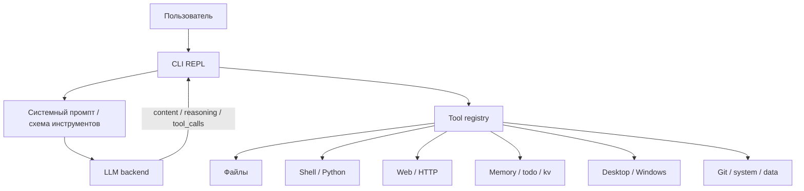
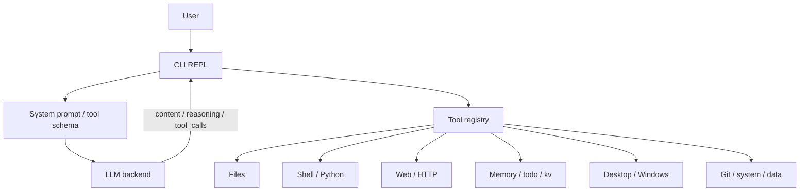

# 🤖 Universal LLM Agent

<p align="center">
  <strong>Лёгкий CLI-агент для локальных и облачных LLM с реальным tool calling</strong><br>
  Один Python-файл • Минимум зависимостей • Native + prompt-based режимы • Windows / Linux / Termux
</p>

<p align="center">
  
  
  
  
</p>

<p align="center">
  <a href="#-русская-версия">Русский</a> · <a href="#-english-version">English</a>
</p>

> [!IMPORTANT]
> Проект находится в активной разработке. Часть возможностей уже рабочая и полезная, но не весь стек обещает полную завершённость, одинаковую стабильность на всех платформах или одинаковое поведение во всех моделях и backends.

> [!WARNING]
> Это инструмент с доступом к реальным действиям. Он снижает риск, но не делает любую модель безопасной по умолчанию. Для критичных задач всегда нужен контроль оператора.

---

# 🇷🇺 Русская версия

## Что это такое

Universal LLM Agent — это CLI-агент, который подключает языковую модель к инструментам операционной системы, файлам, сети, памяти и части desktop-автоматизации. Модель не просто отвечает текстом, а может вызывать функции через единый слой инструментов.

Главная особенность проекта в том, что он умеет работать в двух мирах одновременно:

- с моделями, у которых уже есть нативный `tools` API;
- с моделями, у которых инструментов нет вовсе, но их можно аккуратно “научить” через prompt-based режим.

> [!NOTE]
> Разделы README здесь написаны честно: где возможности уже уверенные, там сказано прямо; где поведение ещё экспериментальное, это тоже отмечено явно.

---

## Статус проекта

> [!WARNING]
> Проект находится в активной доработке.
>
> Это значит:
>
> - часть функций уже работает стабильно;
> - часть функций остаётся экспериментальной / тестовой;
> - внутренние детали, имена параметров и поведение отдельных инструментов могут меняться;
> - обратная совместимость не гарантируется на 100%;
> - для важных сценариев лучше сначала прогнать проверку в контролируемой среде.

---

## Почему этот проект выглядит именно так

Ядро проекта намеренно остаётся простым:

- один Python-файл;
- только стандартная библиотека в самом ядре;
- прозрачный реестр инструментов;
- понятный REPL;
- локальные конфиги без лишнего сервиса;
- поддержка локальных и облачных backend’ов.

Это не попытка собрать “магический AGI-оркестр”. Это практичный агентный runtime: его можно открыть, прочитать, изменить и запустить без лишней инфраструктуры.

---

## Что он умеет по сути

Агент умеет:

- стримить ответ модели по мере генерации;
- отдельно показывать reasoning/thinking;
- собирать tool calls из стрима и из обычного текста;
- переключаться между native и prompt tool calling;
- выполнять несколько независимых вызовов параллельно;
- хранить заметки, todo и KV-данные между сессиями;
- работать с файлами, shell, Python, HTTP, Git, system tools и Windows desktop;
- выдавать понятный цветной CLI-вывод.

---

## Как это работает



### Режимы работы

- `native` — агент передаёт инструменты через OpenAI-совместимый `tools` API;
- `prompt` — агент подсовывает модели Hermes-style инструкции с `<tool_call>`;
- `auto` — агент пробует native, а если backend не поддерживает инструменты, переходит на prompt-fallback.

> [!TIP]
> Для моделей вроде Ollama, LM Studio и vLLM удобнее native-режим. Для llama.cpp и KoboldCpp обычно полезнее prompt-режим.

### Что именно парсится

Из кода видно, что агент умеет:

- стримить `content`;
- стримить `reasoning_content`;
- собирать `tool_calls` по кускам из SSE/стрима;
- разбирать `<think>...</think>`;
- разбирать `<tool_call>...</tool_call>`;
- разбирать `<tools_call>...</tools_call>` для параллельных вызовов;
- извлекать инструмент даже из “сырого” JSON, если модель написала его без тега.

---

## Поддерживаемые backend’ы

| Backend | Native tools | Базовый URL | Комментарий |
|---|---:|---|---|
| Ollama | Да | `http://localhost:11434/v1` | `ollama serve` + `ollama pull <model>` |
| LM Studio | Да | `http://localhost:1234/v1` | Включить Local Server на 1234 |
| vLLM | Да | `http://localhost:8000/v1` | Подходит для tool-calling |
| OpenAI | Да | `https://api.openai.com/v1` | Нужен `OPENAI_API_KEY` |
| OpenRouter | Да | custom | Любой OpenAI-compatible endpoint |
| Groq | Да | `https://api.groq.com/openai/v1` | Нужен `GROQ_API_KEY` |
| Mistral | Да | `https://api.mistral.ai/v1` | Нужен `MISTRAL_API_KEY` |
| KoboldCpp | Нет | `http://localhost:5001/v1` | Prompt fallback |
| llama.cpp | Нет | `http://localhost:8080/v1` | Prompt fallback |
| Anthropic | Да* | через proxy | Требуется OpenAI-compatible прокси |

---

## Установка и запуск

### Windows

Запускать нужно через:

```bat
start_API.bat
```

Лаунчер делает следующее:

- проверяет, установлен ли Python;
- при необходимости скачивает Python 3.11.8;
- добавляет Python в PATH для текущей сессии;
- ставит `psutil`, `win10toast`, `Pillow`;
- открывает меню запуска агента.

### Linux / Termux

```bash
chmod +x start_API.sh
./start_API.sh
```

Лаунчер:

- проверяет наличие `python3`;
- обновляет `pip`;
- устанавливает `psutil` и `Pillow`;
- запускает `local_agent.py`.

> [!NOTE]
> Лаунчеры сделаны специально простыми. Их задача — быстро поднять среду, а не спрятать всё за сложной обвязкой.

---

## Конфигурация и локальные файлы

При первом запуске агент сохраняет профиль и данные в домашней директории пользователя.

| Файл | Назначение |
|---|---|
| `~/.local_agent_user.json` | API key, base URL, model, профиль |
| `~/.local_agent_prompt.json` | Сохранённый системный промпт |
| `~/.local_agent_memory.json` | Локальная память |
| `~/.local_agent_kv.sqlite` | KV-хранилище |
| `~/.local_agent_todos.json` | Список задач |

### Важная деталь про пути

Пути разрешаются относительно `AGENT_WORKSPACE`, если путь относительный. Абсолютные пути тоже возможны. Это удобно, но это не “жёсткая песочница”. Для README это важно писать честно: агент помогает работать с файлами, но не закрывает их бронёй от любой ошибки модели.

---

## CLI-команды

| Команда | Что делает |
|---|---|
| `/tools` | Показать список инструментов и их параметры |
| `/clear` | Очистить историю диалога |
| `/history [N]` | Показать последние N сообщений |
| `/save <file>` | Сохранить сессию |
| `/load <file>` | Загрузить сессию |
| `/system` | Просмотр или редактирование системного промпта |
| `/workspace <dir>` | Сменить рабочую директорию агента |
| `/mode <auto|native|prompt>` | Принудительно переключить режим tool calling |
| `/profile` | Изменить API-профиль |
| `/info` | Показать системную информацию |
| `/exit` | Выйти |

---

## Безопасность: что защищено, а что нет

> [!WARNING]
> Этот проект не является полноценной песочницей. Он снижает риск, но не отменяет его.

В коде есть несколько уровней защиты:

- безопасный калькулятор через AST вместо `eval()`;
- блок-лист опасных shell-команд;
- таймауты на Python, shell и HTTP;
- проверка и нормализация JSON-аргументов;
- ограничение размера JSON для запросов;
- best-effort песочница для Python на Unix;
- защита от слишком длинных regex-паттернов в `grep`.

### Что означает “Тестово”

Слово “Тестово” здесь не декоративное. Оно означает вот что:

- защита **есть**, но она не гарантирует абсолютную безопасность;
- sandbox в Python — это только частичная изоляция, а не полноценный jail;
- shell-команды всё равно остаются опасным инструментом;
- модель может ошибиться, галлюцинировать, перепутать файл, путь или команду;
- плохой промпт может привести к неправильным действиям даже при наличии guardrails.

Именно поэтому проект стоит воспринимать как мощный инструмент для аккуратной автоматизации, а не как неуязвимую систему.

### Что стоит помнить оператору

- не давать расплывчатые команды в критичных задачах;
- не отключать проверки без понимания последствий;
- не запускать непроверенные действия на важной машине;
- проверять, что именно модель собирается сделать, если задача затрагивает файлы, shell или удалённые запросы.

> [!CAUTION]
> Если агенту разрешить выполнять слишком общие или слишком опасные действия без контроля, ответственность за последствия остаётся на операторе, а не на README.

---

## Что проект не обещает

> [!CAUTION]
> Проект не обещает:
>
> - полной безошибочности;
> - стопроцентной безопасности;
> - одинакового поведения на всех моделях;
> - мгновенной совместимости со всеми backends;
> - отсутствия поломок при экспериментальных настройках;
> - гарантированной обратной совместимости между версиями.
>
> Это нормальный инженерный статус для активно развивающегося агента.

---

## Каталог инструментов

У проекта **76 инструментов**. Ниже они сгруппированы так, чтобы было проще понять, что за что отвечает.

<details>
<summary><strong>Файлы и пути</strong> (20)</summary>

- `read_file` — Прочитать текстовый файл. Поддерживает offset для постраничного чтения.
- `write_file` — Записать содержимое в файл. Создаёт родительские директории.
- `edit_file` — Точечная замена текста в файле.
- `list_files` — Список файлов и директорий.
- `search_files` — Рекурсивный поиск файлов по glob-паттерну.
- `grep` — Поиск по содержимому файлов (regex).
- `file_info` — Информация о файле или директории.
- `diff_files` — Сравнить два файла и показать различия (unified diff).
- `find_large_files` — Найти большие файлы (с фильтром node_modules/.git по умолчанию).
- `disk_usage` — Использование диска директориями (с фильтром шумных папок).
- `move` — Переместить файл/директорию.
- `copy_file` — Скопировать файл (с сохранением метаданных).
- `create_dir` — Создать директорию (рекурсивно).
- `path_info` — Нормализует путь и показывает абсолютный путь + тип.
- `binary_read` — Читает бинарный файл (hex/hex_raw/base64/bytes). По умолчанию hex-дамп как у xxd.
- `binary_write` — Пишет бинарные данные (hex/base64/bytes/utf8/cp1251) в файл.
- `binary_patch` — Бинарный патч: заменяет find_hex на replace_hex по offset'у. Длины должны совпадать.
- `checksum_file` — Хеш файла (md5/sha1/sha256/sha512).
- `tail_file` — Последние N строк файла. follow=true — стримить новые (для логов).
- `head_file` — Первые N строк файла.

</details>

<details>
<summary><strong>Код и текст</strong> (20)</summary>

- `run_python` — Выполнить Python-код в подпроцессе. sandbox=true добавляет изоляцию (best-effort).
- `run_shell` — Выполнить shell-команду (bash/cmd).
- `calculator` — Безопасный калькулятор. +, -, *, /, //, %, **, sin, cos, sqrt, pi, e.
- `regex_test` — Тестировать регулярное выражение. Флаги: i, m, s, x.
- `json_query` — Извлечь данные из JSON по точечному пути.
- `format_json` — Форматировать/валидировать JSON.
- `diff_text` — Diff двух текстов (не файлов). Для prompt-инжиниринга.
- `jsonl_read` — Чтение JSON Lines (.jsonl/.ndjson) с фильтром по подстроке.
- `jsonl_write` — Записать JSON-массив или объект как JSON Lines.
- `encode_text` — Перекодировать текст: utf8, cp1251, koi8r, hex, base64, base32, url.
- `decode_text` — Декодировать текст обратно (hex/base64/url/...).
- `base64_encode` — Кодировать текст в Base64.
- `base64_decode` — Декодировать Base64 в текст.
- `hash_string` — Хешировать строку. Алгоритмы: md5, sha1, sha256, sha512.
- `token_estimate` — Грубая оценка числа токенов в тексте (без tiktoken).
- `convert_units` — Конвертация единиц: длина, масса, байты, время, температура.
- `url_encode` — URL-encode строки.
- `url_decode` — URL-decode строки.
- `uuid_gen` — Генерирует UUID (v1, v4 или v7).
- `generate_password` — Генерирует криптостойкий пароль (secrets). length 8-128.

</details>

<details>
<summary><strong>Веб и сеть</strong> (6)</summary>

- `web_search` — Поиск в DuckDuckGo (HTML). Без API-ключа.
- `web_fetch` — Загрузить URL и вернуть текст.
- `http_request` — Произвольный HTTP-запрос.
- `http_retry` — HTTP-запрос с retry + exponential backoff (повтор при 5xx и сетевых ошибках).
- `port_check` — Проверить, открыт ли TCP-порт (Ollama 11434, LM Studio 1234, KoboldCpp 5001).
- `wifi_list` — Список сохранённых WiFi-сетей и их паролей (через netsh). Только Windows.

</details>

<details>
<summary><strong>Память и продуктивность</strong> (8)</summary>

- `get_datetime` — Текущие дата и время.
- `todo` — Управление списком задач. Действия: add, list, done, clear, delete.
- `memory` — Долговременная память между сессиями. save, load, list, delete.
- `kv_store` — Persistent key-value на SQLite (надёжнее JSON при крашах). actions: set, get, list, delete, search.
- `timer` — Установить таймер (блокирующий).
- `notify` — Системное уведомление (Toast/notify-send/msg.exe).
- `env_get` — Получить значение переменной окружения (с маскированием секретов).
- `env_list` — Список всех переменных окружения (с фильтром).

</details>

<details>
<summary><strong>Система и процессы</strong> (8)</summary>

- `system_info` — Информация о системе (CPU, GPU, RAM, диск, ОС).
- `process_list` — Список запущенных процессов.
- `kill_process` — Завершить процесс по PID или имени.
- `service_list` — Список Windows-сервисов (имя, статус, тип запуска).
- `wmi_query` — WMI-запрос (только Windows). Примеры: 'SELECT * FROM Win32_Processor'.
- `registry_read` — Чтение реестра Windows. Пример: 'HKLM\\SOFTWARE\\Microsoft\\Windows NT\\CurrentVersion'.
- `powershell` — Выполнить PowerShell-команду (только Windows).
- `system_stats` — Живая CPU/RAM/диск/батарея/температура. Требует psutil для части метрик.

</details>

<details>
<summary><strong>Git</strong> (3)</summary>

- `git_status` — Git статус директории.
- `git_diff` — Git diff.
- `git_log` — Git log.

</details>

<details>
<summary><strong>Desktop и Windows</strong> (9)</summary>

- `list_windows` — Список всех открытых окон на рабочем столе Windows. Только Windows.
- `get_window_text` — Читает текст из окна: заголовок и дочерние элементы. Только Windows.
- `focus_window` — Выводит окно на передний план. Только Windows.
- `close_window` — Закрывает окно. force=true принудительно завершает процесс. Только Windows.
- `open_program` — Запускает программу, открывает файл или URL. Только Windows.
- `window_send_keys` — Отправляет нажатия клавиш в окно. {ENTER}, {TAB}, {CTRL+a}, {ALT+F4}. Только Windows.
- `click_window` — Кликает по элементу в окне (по тексту или координатам). Только Windows.
- `screenshot_window` — Скриншот окна Windows (сохраняется в файл). Только Windows.
- `clipboard` — Работа с буфером обмена (только Windows). Действия: read, write.

</details>

<details>
<summary><strong>Данные и архивы</strong> (2)</summary>

- `archive` — Упаковка/распаковка архивов (zip/tar/gz/bz2/xz).
- `csv_read` — Прочитать CSV-файл как таблицу.

</details>

---

## Репозиторные скрипты

### `start_API.bat`

Windows-лаунчер с установкой Python и зависимостей.

### `start_API.sh`

Linux/Termux-лаунчер для быстрого старта без лишней магии.

---

## Для кого этот проект

Подходит, если нужен агент, который:

- работает локально;
- не прячется за тяжёлым фреймворком;
- умеет реальные действия, а не только диалог;
- удобен для автоматизации и экспериментов;
- можно быстро прочитать и дописать под себя.

Не подходит, если нужен “готовый магический комбайн”, который сам всё сделает без контроля. Тут всё честнее и ближе к инженерному инструменту.

---

## 📜 Лицензия

На данный момент лицензия для проекта не выбрана.

Честно говоря, пока я не хочу добавлять её просто "для галочки".

Если проект дойдёт до более зрелого состояния и начнёт активно использоваться другими людьми, в репозитории появится файл `LICENSE`, а условия использования будут явно зафиксированы.

До этого момента считайте, что проект находится в активной разработке и вопрос лицензирования остаётся открытым.

---

## Частые вопросы

<details>
<summary><strong>Почему два режима tool calling?</strong></summary>

Потому что не все модели умеют native tools. Одни бэкенды работают через OpenAI-совместимый API, другие — только через prompt-инструкции. Агент умеет оба варианта, чтобы не ломаться на выборе backend’а.

</details>

<details>
<summary><strong>Почему здесь так много защитных оговорок?</strong></summary>

Потому что агент исполняет реальные действия. Красивый README не должен создавать иллюзию абсолютной безопасности там, где её нет.

</details>

<details>
<summary><strong>Почему “Тестово” написано так подробно?</strong></summary>

Потому что это не маркетинговая пометка, а честная техническая граница: защита помогает, но не делает агент безошибочным и не делает модель безопасной по определению.

</details>

---

## Коротко: что делает проект сильным

- один файл;
- реальные инструменты;
- native + prompt fallback;
- streaming;
- параллельные tool calls;
- локальная память;
- Windows / Linux / Termux;
- прозрачность и расширяемость.

---

## Помощь

Если вы нашли баги, ошибки или столкнулись с проблемами, пожалуйста, напишите о них на почту byteghosthelper@gmail.com. Желательно прикрепить к письму файл сохранения (сделав /save bug), чтобы я мог просмотреть сессию и понять, в какой именно момент появилась проблема. Также, пожалуйста, добавьте текстовое описание самой ошибки.

---

# 🇺🇸 English Version

## What it is

Universal LLM Agent is a lightweight CLI agent that connects an LLM to real tools: files, shell, Python, HTTP, memory, Git, system inspection, and parts of desktop automation.

It is designed to work in two worlds at once:

- with models that already support native `tools` APIs;
- with models that do not support tools at all, using a prompt-based Hermes-style fallback.

> [!NOTE]
> This README is intentionally honest about maturity: stable pieces are described as stable, and experimental pieces are called out explicitly.

---

## Project status

> [!WARNING]
> The project is under active development.
>
> That means:
>
> - some features are already reliable and usable;
> - some parts remain experimental / test-oriented;
> - internal details, parameter names, and tool behavior may change;
> - backward compatibility is not guaranteed 100%;
> - for important workflows, test it first in a controlled environment.

---

## Why this project looks this way

The core stays deliberately simple:

- one Python file;
- standard library only in the core;
- a transparent tool registry;
- a straightforward REPL;
- local config files instead of a heavy service stack;
- support for both local and cloud backends.

This is not an attempt to build a magical AGI orchestra. It is a practical agent runtime you can open, read, modify, and run without extra infrastructure.

---

## What it does in practice

The agent can:

- stream model output as it is generated;
- show reasoning / thinking separately;
- collect tool calls from streamed chunks and plain text;
- switch between native and prompt tool calling;
- execute multiple independent tool calls in parallel;
- store notes, todo items, and key-value data between sessions;
- work with files, shell, Python, HTTP, Git, system tools, and Windows desktop actions;
- produce readable, colored CLI output.

---

## How it works



### Operating modes

- `native` — the agent sends tools through the standard OpenAI-compatible `tools` API;
- `prompt` — the agent injects Hermes-style `<tool_call>` instructions into the system prompt;
- `auto` — the agent tries native first and falls back when the backend does not support tools.

> [!TIP]
> For backends like Ollama, LM Studio, and vLLM, native mode is usually the cleanest fit. For llama.cpp and KoboldCpp, prompt mode is often the practical choice.

### What gets parsed

From the code, the agent can:

- stream `content`;
- stream `reasoning_content`;
- accumulate `tool_calls` incrementally from the stream;
- parse `<think>...</think>`;
- parse `<tool_call>...</tool_call>`;
- parse `<tools_call>...</tools_call>` for parallel calls;
- recover tool calls from raw JSON when a model emits JSON without the expected wrapper.

---

## Supported backends

| Backend | Native tools | Default base URL | Notes |
|---|---:|---|---|
| Ollama | Yes | `http://localhost:11434/v1` | `ollama serve` + `ollama pull <model>` |
| LM Studio | Yes | `http://localhost:1234/v1` | Enable the local server on port 1234 |
| vLLM | Yes | `http://localhost:8000/v1` | Good fit for tool calling |
| OpenAI | Yes | `https://api.openai.com/v1` | Needs `OPENAI_API_KEY` |
| OpenRouter | Yes | custom | Any OpenAI-compatible endpoint |
| Groq | Yes | `https://api.groq.com/openai/v1` | Needs `GROQ_API_KEY` |
| Mistral | Yes | `https://api.mistral.ai/v1` | Needs `MISTRAL_API_KEY` |
| KoboldCpp | No | `http://localhost:5001/v1` | Prompt fallback |
| llama.cpp | No | `http://localhost:8080/v1` | Prompt fallback |
| Anthropic | Yes* | via proxy | Requires an OpenAI-compatible proxy |

---

## Installation and launch

### Windows

Launch with:

```bat
start_API.bat
```

The launcher:

- checks whether Python is installed;
- downloads Python 3.11.8 if needed;
- adds Python to PATH for the current session;
- installs `psutil`, `win10toast`, and `Pillow`;
- opens a simple launch menu for the agent.

### Linux / Termux

```bash
chmod +x start_API.sh
./start_API.sh
```

The launcher:

- checks for `python3`;
- upgrades `pip`;
- installs `psutil` and `Pillow`;
- launches `local_agent.py`.

> [!NOTE]
> The launchers are intentionally simple. Their job is to bring the environment up quickly, not hide everything behind a complex wrapper.

---

## Configuration and local files

On first launch, the agent stores profile and local state in the user’s home directory.

| File | Purpose |
|---|---|
| `~/.local_agent_user.json` | API key, base URL, model, user profile |
| `~/.local_agent_prompt.json` | Saved system prompt |
| `~/.local_agent_memory.json` | Local memory |
| `~/.local_agent_kv.sqlite` | KV storage |
| `~/.local_agent_todos.json` | Todo list |

### Important note about paths

Relative paths are resolved against `AGENT_WORKSPACE`. Absolute paths are allowed too. That is convenient, but it is not a hard sandbox. The README should say this plainly: the agent helps you work with files, but it does not magically armor them against every model mistake.

---

## CLI commands

| Command | What it does |
|---|---|
| `/tools` | Show available tools and parameters |
| `/clear` | Clear the current conversation history |
| `/history [N]` | Show the last N messages |
| `/save <file>` | Save the session |
| `/load <file>` | Load a session |
| `/system` | View or edit the system prompt |
| `/workspace <dir>` | Change the agent workspace |
| `/mode <auto|native|prompt>` | Force a tool-calling mode |
| `/profile` | Edit the API profile |
| `/info` | Show system information |
| `/exit` | Quit |

---

## Security: what is protected, and what is not

> [!WARNING]
> This project is not a full sandbox. It reduces risk, but it does not eliminate it.

The code includes several layers of protection:

- AST-based calculator instead of `eval()`;
- a blocklist for dangerous shell commands;
- timeouts for Python, shell, and HTTP;
- JSON argument validation and normalization;
- size limits for JSON payloads;
- a best-effort Python sandbox on Unix;
- protection against overly long regex patterns in `grep`.

### What “experimental / test-oriented” means

“Test-oriented” is not just a decorative label. It means:

- protection exists, but it does not guarantee absolute safety;
- the Python sandbox is partial isolation, not a true jail;
- shell commands are still dangerous tools;
- the model may hallucinate, misread a file, or generate the wrong command;
- a bad prompt can still cause unwanted behavior even with guardrails.

That is why this project should be treated as a powerful automation tool, not as an invulnerable system.

### What the operator should keep in mind

- avoid vague instructions in critical workflows;
- do not disable checks without understanding the consequences;
- do not run unverified actions on important machines;
- inspect what the model is about to do when files, shell, or network requests are involved.

> [!CAUTION]
> If the agent is allowed to execute broad or dangerous actions without supervision, the responsibility for the outcome stays with the operator, not with the README.

---

## What the project does not promise

> [!CAUTION]
> The project does not promise:
>
> - zero bugs;
> - perfect safety;
> - identical behavior across all models;
> - instant compatibility with every backend;
> - no breakage under experimental settings;
> - guaranteed backward compatibility between versions.
>
> That is a normal engineering status for an actively evolving agent.

---

## Tool catalog

The project exposes **76 tools**. They are grouped below so the purpose of each area stays easy to understand.

<details>
<summary><strong>Files & paths</strong> (20)</summary>

Read, write, search, diff, inspect and patch files, folders, and binary data.

Exact tool names:
- `read_file`
- `write_file`
- `edit_file`
- `list_files`
- `search_files`
- `grep`
- `file_info`
- `diff_files`
- `find_large_files`
- `disk_usage`
- `move`
- `copy_file`
- `create_dir`
- `path_info`
- `binary_read`
- `binary_write`
- `binary_patch`
- `checksum_file`
- `tail_file`
- `head_file`

</details>

<details>
<summary><strong>Code & text</strong> (20)</summary>

Run code, evaluate expressions, inspect JSON, transform text, and encode/decode data.

Exact tool names:
- `run_python`
- `run_shell`
- `calculator`
- `regex_test`
- `json_query`
- `format_json`
- `diff_text`
- `jsonl_read`
- `jsonl_write`
- `encode_text`
- `decode_text`
- `base64_encode`
- `base64_decode`
- `hash_string`
- `token_estimate`
- `convert_units`
- `url_encode`
- `url_decode`
- `uuid_gen`
- `generate_password`

</details>

<details>
<summary><strong>Web & network</strong> (6)</summary>

Search the web, fetch pages, issue HTTP requests, and check network state.

Exact tool names:
- `web_search`
- `web_fetch`
- `http_request`
- `http_retry`
- `port_check`
- `wifi_list`

</details>

<details>
<summary><strong>Memory & productivity</strong> (8)</summary>

Store notes, todos, key-value data, timestamps, and environment information locally.

Exact tool names:
- `get_datetime`
- `todo`
- `memory`
- `kv_store`
- `timer`
- `notify`
- `env_get`
- `env_list`

</details>

<details>
<summary><strong>System & processes</strong> (8)</summary>

Inspect processes, services, registry, WMI, and general system state.

Exact tool names:
- `system_info`
- `process_list`
- `kill_process`
- `service_list`
- `wmi_query`
- `registry_read`
- `powershell`
- `system_stats`

</details>

<details>
<summary><strong>Git</strong> (3)</summary>

Inspect repository state and history.

Exact tool names:
- `git_status`
- `git_diff`
- `git_log`

</details>

<details>
<summary><strong>Desktop & Windows</strong> (9)</summary>

Interact with windows, keyboard, mouse, clipboard, and screenshots on Windows.

Exact tool names:
- `list_windows`
- `get_window_text`
- `focus_window`
- `close_window`
- `open_program`
- `window_send_keys`
- `click_window`
- `screenshot_window`
- `clipboard`

</details>

<details>
<summary><strong>Data & archives</strong> (2)</summary>

Work with archives and CSV data.

Exact tool names:
- `archive`
- `csv_read`

</details>

---

## Repository scripts

### `start_API.bat`

A Windows launcher that bootstraps Python and dependencies.

### `start_API.sh`

A Linux / Termux launcher for a quick startup without extra ceremony.

---

## Who this project is for

This fits if you want an agent that:

- works locally;
- does not hide behind a heavy framework;
- can perform real actions, not just chat;
- is practical for automation and experiments;
- is readable enough to be extended by hand.

It is not for people who want a “magic all-in-one bot” that should safely handle everything without oversight. This project is more honest and more engineering-oriented.

---

## 📜 License

At this point, no license has been selected for the project.

Honestly, I don't want to add it just for the sake of it.

If the project matures and begins to be actively used by others, a `LICENSE` file will appear in the repository, and the terms of use will be clearly stated.

Until then, consider the project to be in active development, and the licensing issue remains open.

---

## FAQ

<details>
<summary><strong>Why two tool-calling modes?</strong></summary>

Because not every model supports native tools. Some backends work through an OpenAI-compatible API, while others only work through prompt instructions. The agent supports both so the backend choice does not become a dead end.

</details>

<details>
<summary><strong>Why so many safety notes?</strong></summary>

Because the agent executes real actions. A polished README should not create an illusion of absolute safety where none exists.

</details>

<details>
<summary><strong>Why is “test-oriented” explained so thoroughly?</strong></summary>

Because it is not a marketing label. It is a real technical boundary: guardrails help, but they do not make the agent flawless or the model safe by definition.

</details>

---

## In one line

- one file;
- real tools;
- native + prompt fallback;
- streaming;
- parallel tool calls;
- local memory;
- Windows / Linux / Termux;
- transparent and extensible.

---

## Help

If you find any bugs, errors, or encounter any issues, please report them to byteghosthelper@gmail.com. It is highly recommended to attach a save file (created with the /save bug command) to your email, so I can review the session and pinpoint exactly when the problem occurred. Please also include a detailed text description of the error itself.
